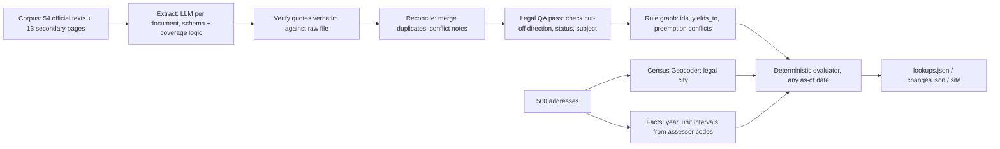

# Lexmap: Rental Housing Law Navigator

**Which housing rules apply at this address today, and what is about to change?**
Lexmap reads a corpus of real state and city housing law and turns it into executable rules. It answers any sample address (or any address you type) in California, New Jersey and Massachusetts, for any date. Every answer quotes the law it comes from.

**Live demo:** https://suvyakth.github.io/lexmap/ · **Method note:** [METHOD_NOTE.md](METHOD_NOTE.md) · **Self-check:** [submission/selfcheck_report.md](submission/selfcheck_report.md)

> **Not legal advice.** Lexmap summarises public law from a fixed research corpus (retrieved 2026-10-01) to make it easier to see. It is not a compliance certification.

Built for the Hack-Nation 7th Global AI Hackathon, RealPage challenge "Rental Housing Law Navigator".

---

## What makes it different

Most systems ask a model "which rules apply here?" Lexmap uses the model only to *read the law*. Answers come from a deterministic evaluator:

1. **Rules compile to executable coverage logic.** Each extracted rule carries a small predicate tree, for example `exempt: certificate_of_occupancy > 1979-06-13`. A three-valued (true / false / unknown) evaluator checks it against the building's facts. The same rule set answers every address at every date, identically every time.
2. **Every quote is verified verbatim.** A `quoted_span` that cannot be found character-for-character in the source file is repaired or rejected. In this submission 129 of 129 spans are verified: 90 exact and 39 whitespace-normalised.
3. **Honest "unknown", with the missing fact named.** Year built is not the certificate-of-occupancy date, so a building in a cut-off year is `unknown`. So is a Berkeley building with no year in the data. The answer says which fact is missing. An exemption that the known facts rule out is resolved without owner data: a 20-unit building cannot use a "2 units or fewer" exemption.
4. **Precedence and conflicts are first-class.** State caps yield to local rent control and show as `superseded`. A state law exempting new buildings from local rent control removes those buildings. The NJ FAIR Act's ban on conflicting municipal ordinances flags Jersey City and Hoboken for human review. Rules where sources disagree, such as two published effective dates, are flagged.
5. **Two model passes check the first.** A reconciler merges duplicate records across sources and writes conflict notes. A separate QA pass reviews every consolidated rule against its source excerpts, looking especially at the direction of cut-offs. It may change only whitelisted fields, and every change is logged.
6. **Reproducible and auditable.** Every model call is cached by the SHA-256 of model and prompt. `python run.py` reproduces every file in `submission/` and `docs/data/` offline, with no API key. `submission/audit_log.jsonl` records sources with hashes, model calls, rejected candidates and every answer.

## Results

| | |
|---|---|
| Source documents read | 67: 54 official corpus texts plus 13 organiser-listed secondary pages |
| Candidate records extracted, then consolidated | 107, then **55 rules** in all 6 categories, 3 states and 10 cities |
| Quotes verified verbatim against the source file | 129 / 129 |
| Address lookups (500 addresses, as of 2026-10-01) | 5,301 answers: `applies`, `unknown`, `superseded`, `not_yet_effective`, `pending` |
| Census-geocoded legal jurisdiction | 487 / 500. The other 13 use the mailing city, flagged low confidence |
| Change tests T1–T5 | all match the expected behaviour, including T3's 90 conflict flags |
| Self-check | **44 / 44** ([report](submission/selfcheck_report.md)) |
| Browser engine vs Python engine | 2,000 / 2,000 identical answers (500 addresses × 4 dates) |

The participant pack we received contained no `score.py` and no dev answer key, so `lexmap/selfcheck.py` implements every check the brief makes explicit. It covers the schema, verbatim citations, jurisdiction boundaries, T1–T5 and "no rent cap in Massachusetts".

## How it works



| Stage | File | What it does |
|---|---|---|
| Corpus | `lexmap/corpus.py` | Parses the `SOURCE:`/`RETRIEVED:` headers. Drops navigation lines that repeat across a site's pages (never rewrites text). Chunks long documents. |
| Secondary pages | `lexmap/fetch_links.py` | Fetches only the manifest's *secondary* link-only pages, once, politely. Code publishers marked "check-terms" are **not** fetched. |
| Module A, extract | `lexmap/extract.py`, `lexmap/prompts.py` | One call per document. Validates against the schema, computes "first day of the Nth month after enactment" dates deterministically, and verifies or repairs quotes. |
| Module A, reconcile | `lexmap/reconcile.py` | Groups by jurisdiction and category, merges sources, flags disagreements, assigns ids (matching `dev/change_tests.json`), wires precedence and preemption. |
| Module A, QA | `lexmap/qa.py` | An independent review of each rule against its source excerpts. 26 rules were corrected, each change logged in `provenance`. |
| Module B, geocode | `lexmap/geocode.py` | Uses the Census Geocoder's Incorporated Place, so Dorchester resolves to Boston and San Ysidro to San Diego. Detects out-of-state owner ZIPs on 25 NJ rows and ignores them. |
| Module B, facts | `lexmap/facts.py` | Year built and unit *intervals*. Lower bounds come from assessor codes, e.g. NJ class 4C means 5+ units and `6B-20U-G` means 20 units. Owner facts are always unknown. |
| Module B, evaluate | `lexmap/coverage.py`, `lexmap/lookup.py` | Kleene three-valued logic over intervals, plus the decision table (see the docstring). |
| Module C | `lexmap/changes.py` | Runs T1–T5 generically from `change_tests.json`: as-of flips, boundaries, "if enacted" for pending bills, and negative tests. |
| What-if | `lexmap/whatif.py` | Runs any **new law** through the same pipeline and lists the addresses it changes, before and after. |
| Plain language | `lexmap/explain.py` | English and Spanish summaries. Any number not in the rule record discards the summary. |
| Site | `docs/` | Static page. `docs/engine.js` is a line-for-line port of the evaluator, so any address or date is answered in the browser. |

## Run it

```bash
pip install -r requirements.txt          # requests, beautifulsoup4, pandas, jsonschema
python run.py                            # reproduce everything from cached model calls (no key needed)
python run.py --address A0107 --as-of 2026-10-01     # one lookup in the terminal
python run.py whatif data/whatif/fictional_cambridge_ordinance.txt --jurisdiction "Cambridge, MA"
python -m lexmap.selfcheck               # the self-check report
node tests/parity.js                     # browser engine == Python engine
python -m unittest discover -s tests -v  # unit + end-to-end tests
python -m http.server -d docs 8000       # the site at http://localhost:8000
```

To re-run the model calls live, set `OPENROUTER_API_KEY` in `.env` (see `.env.example`), or install the Claude Code CLI, then run `python run.py --live`. Models are Claude Sonnet 5.5 for extraction and summaries, and Claude Opus 5.5 for reconciliation and QA. Both are configurable in `lexmap/config.py`.

## Output files

| File | Contents |
|---|---|
| `submission/rules.json` | `{"rules": [...]}` in the provided schema, plus `coverage_logic`, `yields_to`, `conflicts_with`, `supporting_spans`, `corroborating_sources`, `plain_language` (EN/ES) and `provenance` |
| `submission/lookups.json` | `{"as_of": "2026-10-01", "lookups": {address_id: [{team_rule_id, result, explanation, conflict_flag}]}}` for all 500 addresses |
| `submission/changes.json` | `{test_id: {affected_address_ids, conflict_flag_address_ids, notes}}` for T1–T5. Before/after detail is in `build/changes_detailed.json` |
| `submission/audit_log.jsonl` | Sources with SHA-256 hashes, model-call keys, rejected candidates, rule provenance, every answer |
| `submission/selfcheck_report.md` | 44 checks with details |
| `build/` | Intermediate artefacts: candidates, reconciled rules with QA notes, geocodes, what-if reports |

## Responsible design

- **"Not legal advice" on every screen.** No compliance verdicts, and nothing that suggests how to avoid a rule.
- **No invented rules or citations.** Unverifiable quotes are rejected. Plain-language summaries are number-checked against the record.
- **Enacted, not-yet-effective, pending and failed measures stay separate.** The struck Massachusetts ballot question is recorded as `failed` and never reported as a rent cap.
- **`unknown` instead of guessing,** with the missing fact named. Conflicts and low-confidence sources are flagged for human review. Secondary-only rules are capped at 0.6 confidence.
- **Public data only.** No owner names, no scraping against site terms. The custom-address box sends the address only to the U.S. Census Geocoder.

## Known limitations

- Hoboken, Newark and Jersey City ordinance texts (rent control and others) are link-only on code publishers whose terms we did not override. Lexmap knows the Jersey City and Hoboken algorithmic bans from a secondary law-firm source (confidence 0.6). It reports gaps instead of guessing, as shown in the site's "Where the corpus has no rule" panel.
- Owner facts (owner-occupied, natural person versus corporation) are not in the data. Exemptions that depend on them resolve to `unknown` unless building facts rule them out.
- Year built stands in for the certificate-of-occupancy date, and the cut-off year is always `unknown`.
- County-level rules are out of scope; the corpus has none.

## Scalability path

A new jurisdiction means new documents in the manifest and one command. Extraction, verification, reconciliation and QA are jurisdiction-agnostic, and the evaluator never changes. `whatif.py` already ingests an unseen ordinance end to end in under a minute. Next steps:
- Pull bill status from LegiScan or Open States to refresh `pending` automatically.
- Re-run extraction when a source hash changes. The audit log stores the hashes.
- Add county parcel feeds for building facts.
- Let reviewers accept or reject QA changes in the UI.

## Repository map

```
run.py                 pipeline entry point
lexmap/                pipeline modules (see table above)
docs/                  static site (GitHub Pages) + engine.js
data/raw/              starter pack (corpus, addresses, schema, change tests, participant guide)
data/supplementary/    fetched secondary pages (same header format as the corpus)
data/cache/            cached model calls + geocoder responses (reproducibility)
data/whatif/           a clearly-labelled FICTIONAL ordinance used to demo change tracking
submission/            rules.json, lookups.json, changes.json, audit log, self-check report
tests/                 unit tests, browser/Python parity test, site smoke test
```
