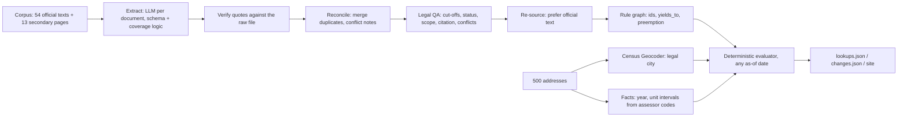

# Lexmap: Rental Housing Law Navigator

[](https://github.com/suvyakth/lexmap/actions/workflows/reproduce.yml)

**Which housing rules apply at this address today, and what is about to change?**
Lexmap reads a corpus of real state and city housing law and turns it into executable rules. It answers any of the 500 sample addresses (or any address you type) in California, New Jersey and Massachusetts, for any date. Every answer quotes the law it comes from.

**Live demo:** https://suvyakth.github.io/lexmap/ · **Method note:** [METHOD_NOTE.md](METHOD_NOTE.md) · **Self-check report:** [submission/selfcheck_report.md](submission/selfcheck_report.md)

> **Not legal advice.** Lexmap summarises public law from a fixed research corpus (retrieved 2026-10-01) to make it easier to see. It is not a compliance certification.

Built for the Hack-Nation 7th Global AI Hackathon, RealPage challenge "Rental Housing Law Navigator".

---

## Scores we can measure

The organisers confirmed that the v5 participant release is current. `score.py` and the dev answer key are not shared with participants, and the hour-16 ordinance is removed (five change tests, T1–T5). So `lexmap/selfcheck.py` implements every check the brief and the participant guide state explicitly, and we report those. The organisers also confirmed that the citation metric counts only supplied corpus text. That is why 96% of our `applies` answers quote official corpus text; the few rules known only from organiser-listed secondary pages are kept for coverage and marked as secondary.

| Check | Result |
|---|---|
| Self-check (schema, citations, jurisdiction boundaries, T1–T5, guardrails) | **44 / 44 pass** |
| T1: CA AB 325, `not_yet_effective` on 2025-12-31 and `applies` on 2026-01-02 | all 250 CA addresses ✓ |
| T2: Hoboken and Jersey City bans stay inside city limits | 90 addresses, 0 in Newark ✓ |
| T3: NJ FAIR Act, `not_yet_effective` now and `applies` on 2027-07-02, with conflict flags | 140 NJ addresses, 90 flagged (JC + Hoboken) ✓ |
| T4: MA S.2983 / H.5222, pending, never in force | 110 MA addresses would be affected if enacted ✓ |
| T5: MA rent-control ballot question struck | affected set empty; no rent cap on any MA address ✓ |
| T6 | removed by the organisers (this edition uses five change tests). A drop-in path for new ordinances is still built in and rehearsed ([checklist](SUBMISSION_CHECKLIST.md)) |
| Quotes located verbatim in their source file | 129 / 129 |
| `applies` answers whose quote is in the official corpus text | 96% (3,375 / 3,512). The rest come from organiser-listed secondary pages |
| Browser engine vs Python engine | 2,000 / 2,000 identical answers (500 addresses × 4 dates) |
| Unit + end-to-end tests | 129 / 129 (`python -m unittest discover -s tests`) |
| Clean Linux rebuild in CI from cached model calls | outputs byte-identical to the committed submission ([workflow](.github/workflows/reproduce.yml)) |

## What makes it different

Most systems ask a model "which rules apply here?" Lexmap uses the model only to *read the law*. Answers come from a deterministic evaluator:

1. **Rules compile to executable coverage logic.** Each extracted rule carries a small predicate tree, for example `exempt: certificate_of_occupancy > 1979-06-13`. A three-valued (true / false / unknown) evaluator checks it against the building's facts. The same rule set answers every address at every date, identically every time.
2. **Every quote is located in the raw source file.** Matching tolerates whitespace and quote-style differences: 90 of 129 quotes matched exactly as generated and 39 after normalising whitespace. The stored `quoted_span` is always the exact raw characters of the file. A quote that cannot be located is re-selected from the closest passages or rejected.
3. **Honest "unknown", with the missing fact named.** Year built is not the certificate-of-occupancy date, so a building in a cut-off year is `unknown`. So is a Berkeley building with no year in the data. An exemption the known facts rule out is resolved without owner data: a 20-unit building cannot use a "2 units or fewer" exemption.
4. **Precedence and conflicts are first-class.**
   - State caps yield to local rent control, giving `superseded`. A local rule that applies wins even when the state rule's own exemption is unknown.
   - A state law exempting new buildings from local rent control removes those buildings (NJ's 30-year exemption).
   - The NJ FAIR Act's ban on conflicting municipal ordinances flags Jersey City and Hoboken for human review.
5. **Three model passes, each checking the last.**
   - A reconciler merges duplicate records across sources.
   - An independent legal-QA pass reviews every rule against its own source excerpts. It checks the direction of every cut-off, status and dates, landlord- vs municipality-level, citation, whether a state statute is limited to one city, whether the rule only bites on an event such as demolition or condo conversion, and whether a source disagreement is still open. It may change only whitelisted fields; 32 rules were corrected and every change is logged.
   - A re-sourcing pass replaces a secondary quote with official corpus text wherever an official document states the same requirement.
6. **Reproducible and auditable.** Every model call is cached by the SHA-256 of model and prompt. `python run.py` reproduces every file in `submission/` and `docs/data/` offline, with no API key. `submission/audit_log.jsonl` records sources with hashes, model-call keys, rejected candidates, rule provenance and every answer.

### What we deliberately do not report as "applies"
- **Failed measures**, such as the struck MA ballot question. They are kept in `rules.json` as `failed`.
- **Laws that only restrict cities**, such as M.G.L. c. 40P. They are shown as context on the "no rule" card.
- **Event-only rules** (5 rules: demolition relocation, the Ellis Act, condo conversion, temporary displacement). They stay in `rules.json` and on the site, under "only if a specific event happens", but are not listed in `lookups.json`, because they do not govern the building's ordinary tenancies.
- **State statutes whose text limits them to one city**, reported only for that city. Example: Civ. Code § 1947.9, which applies only in San Francisco.

### About rule ids
Ids are `<JURISDICTION>-<CATEGORY>-<nn>`, with `P<n>` for pending or failed measures. The change-test file names seven ids (`CA-ALG-01`, `NJ-ALG-01`, …). `reconcile.align_test_ids` makes sure those names point at the matching records, for example the FAIR Act record carries `NJ-ALG-01`, so the organisers' tests can find them. It only renames. It never changes a rule's content or any answer.

## How it works



| Stage | File | What it does |
|---|---|---|
| Corpus | `lexmap/corpus.py` | Parses the `SOURCE:`/`RETRIEVED:` headers. Drops navigation lines that repeat across one site's pages (never rewrites text). Chunks long documents. Loads hour-16 releases from `data/hour16/`. |
| Secondary pages | `lexmap/fetch_links.py` | Fetches only the manifest's *secondary* link-only pages, once. Code publishers marked "check-terms" are **not** fetched. Pages that refuse (403/429) are skipped. |
| Extract | `lexmap/extract.py`, `lexmap/prompts.py` | One call per document. Validates against the schema, computes "first day of the Nth month after enactment" dates in code, and verifies or repairs quotes. No document is excluded by hand. |
| Reconcile | `lexmap/reconcile.py` | Groups by jurisdiction and category, merges sources, cleans citations to their primary form (full text kept in `citation_full`), assigns ids, wires precedence and preemption. |
| Legal QA | `lexmap/qa.py` | An independent review of each rule against its source excerpts (see point 5 above). |
| Re-source | `lexmap/resource.py` | Secondary quote → official passage, when an official document states the same requirement. |
| Geocode | `lexmap/geocode.py` | Uses the Census Geocoder's Incorporated Place, so Dorchester resolves to Boston and San Ysidro to San Diego. Rejects matches with a different house number. Ignores out-of-state owner ZIPs (27 NJ rows). |
| Facts | `lexmap/facts.py` | Year built and unit *intervals*. Lower bounds come from assessor codes, e.g. NJ class 4C means 5+ units and `6B-20U-G` means 20 units. A unit count that contradicts the assessor class is not used. Owner facts are always unknown. |
| Evaluate | `lexmap/coverage.py`, `lexmap/lookup.py` | Kleene three-valued logic over intervals, plus the decision table in the `lookup.py` docstring. |
| Change tests | `lexmap/changes.py` | Runs T1–T5 generically from `change_tests.json`, plus a T6 for every hour-16 release. |
| What-if | `lexmap/whatif.py` | Runs any new law through the same pipeline and lists the addresses that change, before and after. |
| Plain language | `lexmap/explain.py` | English and Spanish summaries. Any number not in the rule record discards the summary. |
| Site | `docs/` | Static page. `docs/engine.js` is a line-for-line port of the evaluator, so any address or date is answered in the browser. Typed-in addresses are geocoded live (Census). In New Jersey the statewide public parcel layer (NJOGIS MOD-IV) adds property class, year built and dwellings, so a shop is recognised as "not a residential rental". Any fact still missing becomes a short question, and every rule is re-checked as you answer. The map uses OpenStreetMap. |

## Run it

```bash
pip install -r requirements.txt          # Python 3.9+; requests, beautifulsoup4, pandas, jsonschema
python run.py                            # reproduce everything from cached model calls (no key needed)
python run.py --address A0107 --as-of 2026-10-01     # one lookup in the terminal
python run.py whatif data/whatif/fictional_cambridge_ordinance.txt --jurisdiction "Cambridge, MA"
python -m lexmap.selfcheck               # the self-check report
node tests/parity.js                     # browser engine == Python engine
python -m unittest discover -s tests -v  # 129 unit + end-to-end tests
python -m http.server -d docs 8000       # the site at http://localhost:8000
```

To re-run the model calls live, set `OPENROUTER_API_KEY` in `.env` (see `.env.example`), or install the Claude Code CLI, then run `python run.py --live`. Models are Claude Sonnet 5.5 for extraction and summaries, and Claude Opus 5.5 for reconciliation, QA and re-sourcing. Both are configurable in `lexmap/config.py`. A full live run takes about 5 minutes.

## Output files

| File | Contents |
|---|---|
| `submission/rules.json` | `{"rules": [...]}` in the provided schema, plus `coverage_logic`, `scope`, `applies_only_in`, `yields_to`, `conflicts_with`, `supporting_spans`, `corroborating_sources`, `plain_language` (EN/ES), `citation_full` and `provenance` |
| `submission/lookups.json` | `{"as_of": "2026-10-01", "lookups": {address_id: [{team_rule_id, result, explanation, conflict_flag}]}}` for all 500 addresses |
| `submission/changes.json` | `{test_id: {affected_address_ids, conflict_flag_address_ids, notes}}`. Before/after detail is in `build/changes_detailed.json` |
| `submission/audit_log.jsonl` | Sources with SHA-256 hashes, model-call keys, rejected candidates, rule provenance, every answer |
| `submission/selfcheck_report.md` | 44 checks with details |
| `build/` | Intermediate artefacts: candidates, reconciled rules with QA notes, geocodes, what-if reports, reviewer notes |

## Responsible design

- **"Not legal advice" on every screen.** No compliance verdicts, and nothing that suggests how to avoid a rule.
- **No invented rules or citations.** Unlocatable quotes are rejected. Plain-language summaries are number-checked against the record.
- **Enacted, not-yet-effective, pending and failed measures stay separate,** with an as-of date on every answer.
- **`unknown` instead of guessing,** with the missing fact named. On the custom-address form, blank fields stay unknown.
- **Conflict flags only for open questions.** Today that is 3 rules: the FAIR Act possibly preempting the Jersey City and Hoboken bans. Discrepancies that review resolved are kept in `source_notes` and shown on the site.
- **Confidence is model-reported,** capped at 0.6 for secondary-only sources and 0.75 for rules flagged for review. It is not a calibrated probability. Answers built on secondary sources say so in their explanation.
- **Dates mean what they say.** `effective_date` is when the quoted version took effect. A separate pass marks amendments of long-standing rules (e.g. Civ. Code § 1950.5 as amended by AB 12), so an as-of query before that date says "an earlier version applies" instead of "not yet effective". The site's date picker starts at 2024-01-01.
- **Public data only.** No owner names, no scraping against site terms. The custom-address box sends the address only to the U.S. Census Geocoder.

## Known limitations

- The corpus has no ordinance text for Newark, nor for Hoboken and Jersey City rent control. Those pages are link-only on a code publisher whose terms we did not override. Newark therefore has no city rule. The Jersey City and Hoboken algorithmic bans come from a law-firm summary (confidence 0.6). The site's "Where the corpus has no rule" panel lists every gap.
- Owner facts (owner-occupied, natural person versus corporation) are not in the data. Exemptions that depend on them resolve to `unknown` unless building facts rule them out.
- Year built stands in for the certificate-of-occupancy date, and the cut-off year is always `unknown`.
- County-level rules are out of scope; the corpus has none.

## Scalability path

Adding a jurisdiction takes its documents (a manifest row each), one line in `config.py` mapping the Census place name to the city, and the same line in `docs/app.js` for live lookups. Extraction, verification, reconciliation, QA and the evaluator are jurisdiction-agnostic. `whatif.py` already ingests an unseen ordinance end to end in under a minute. Next steps:
- Pull bill status from LegiScan or Open States to refresh `pending` automatically.
- Re-extract when a source hash in the audit log changes.
- Add county parcel feeds for building facts.
- Let reviewers accept or reject QA changes in the UI.

## Repository map

```
run.py                 pipeline entry point
lexmap/                pipeline modules (see table above)
docs/                  static site (GitHub Pages) + engine.js
data/raw/              starter pack (corpus, addresses, schema, change tests, participant guide)
data/supplementary/    fetched secondary pages (same header format as the corpus)
data/hour16/           drop-in folder for an organiser mid-event release (empty)
data/cache/            cached model calls + geocoder responses (reproducibility)
data/whatif/           a clearly-labelled FICTIONAL ordinance used to demo change tracking
submission/            rules.json, lookups.json, changes.json, audit log, self-check report
tests/                 unit tests, browser/Python parity test, site smoke test
```
